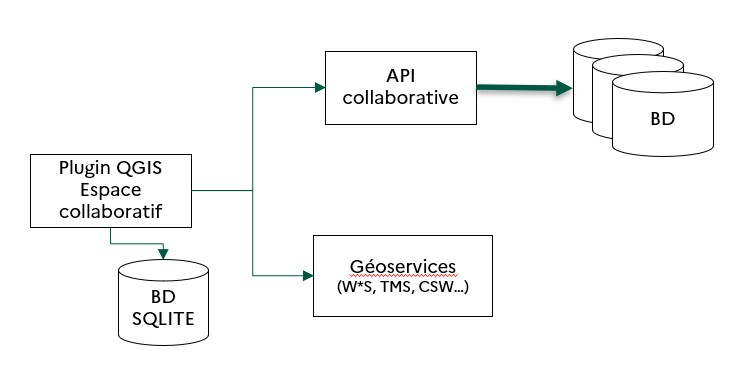

# IGN Espace Collaboratif — Documentation Développeur

Plugin QGIS permettant d'interagir avec l'API collaborative IGN depuis QGIS.

---

## Table des matières

1. [Présentation](#présentation)
2. [Architecture](#architecture)
3. [API REST IGN](#api-rest-ign)
4. [Modèles de données](#modèles-de-données)
5. [Configuration et profils](#configuration-et-profils)
6. [Base de données locale](#base-de-données-locale)
7. [Tests](#tests)
8. [Dépendances](#dépendances)

---

## Présentation

Le plugin offre deux fonctionnalités principales :

- **Signalements** : importer, consulter, créer et répondre à des rapports géolocalisés adressés aux services IGN.
- **Contribution directe (Guichets)** : charger, éditer et synchroniser des couches vecteur avec les bases de données hébergées sur la plateforme.

---

## Architecture



Certaines variables font référence à Ripart.
Ripart désigne le nom historique pour l'espace collaboratif, il s'agit d'un acronyme pour : "Remontées d'Informations PARTagées" ou "Remontées d'Informations PARTenaires".

```
QGIS Interface
      │
      ▼
RipartPlugin          ← Point d'entrée, barre d'outils, signaux QGIS
      │
      ├── Contexte              ← État de session (profil, client, BDD, layers)
      │
      ├── FormConnection        ← Authentification
      ├── ImporterRipart        ← Import des signalements
      ├── CreerRipart           ← Création de signalements
      ├── SeeReport             ← Consultation
      ├── ReplyReport           ← Réponse à un signalement
      └── ImporterGuichet       ← Contribution directe (guichets)
              │
      ┌───────┴────────────────────────┐
      │                                │
   core/Client                  core/SQLiteManager
   core/RipartServiceRequest    (cache local)
   core/XMLResponse
   core/WfsGet / WfsPost
```


**Singleton de session** : `Contexte` est instancié une fois et transmis à tous les orchestrateurs. Il expose : `profil`, `client`, `dbPath`, `iface`, `project`.

---

## API REST IGN

La documentation de l'API collaborative est disponible ici :  
<https://espacecollaboratif.ign.fr/gcms/api/doc/>

**Authentification** : HTTP Basic Auth sur tous les appels.  
**Proxy** : lu depuis les paramètres QGIS (`QSettings`) et injecté dans `Client.__proxies`.

| Endpoint | Méthode | Rôle | Format |
|---|---|---|---|
| `/api/georem/geoaut_get.xml` | GET | Profil utilisateur, groupes, droits | XML |
| `/api/georem/georem_get` | GET | Signalements (paginé, filtré par bbox) | JSON |
| `/api/georem/georem_post` | POST | Créer un signalement | Multipart |
| `/api/georem/georem_put` | PUT | Ajouter une réponse | JSON |
| `/gcms/wfs` | GET | Features guichet (WFS GetFeature) | JSON |
| `/gcms/wfstransactions` | POST | Transactions WFS (INSERT/UPDATE/DELETE) | XML/WKT |

---

## Modèles de données

### `Remarque` (signalement)
Champs clés : `id`, `position` (Point), `statut`, `commentaire`, `auteur` (Author), `listeGeoReponse` (GeoResponse[]), `listeSketch` (Sketch[]), `listeDocument`, `listeTheme` (Theme[]).

### `Profil`
Champs clés : `auteur` (Author), `geogroup` (Group), `themes`, `statut`, `prive`, `zoneGeographique`.

### `Sketch`
Types (`sketchType`) : `Vide`, `Point`, `Ligne`, `Polygone`, `Texte`, `Fleche`.  
Contient une liste de `Point` et des `SketchAttributes` (clé/valeur).

### Constantes clés (`ConstanteRipart`)
| Constante | Valeur |
|---|---|
| `MAX_TAILLE_UPLOAD_FILE` | 16 Mo |
| `RIPART_CLIENT_PROTOCOL` | `"_RIPART_QGIS_99712"` |
| `STATUT` | `undefined`, `submit`, `pending`, `valid`, `reject`, … |
| `ZoneGeographique` | `FXX` (France), `GLP`, `MYT`, `REU`, `MTQ`, … |

---

## Configuration et profils

### Fichiers de config XML (par projet)
Gérés par `RipartHelper` :

| Clé XML | Rôle |
|---|---|
| `xml_Pagination` | Taille de page pour les requêtes |
| `xml_DateExtraction` | Filtre date import signalements |
| `xml_Group` | Accès groupe privé (booléen) |
| `xml_CalqueFiltrage` | Couche source de la bbox de filtrage |

### Préférences utilisateur (persistées)
- `save_login()` / `load_login()` — identifiants
- `save_groupeactif()` / `load_groupeactif()` — groupe actif
- `save_preferredThemes()` / `load_preferredThemes()` — thèmes favoris

---

## Base de données locale

Fichier : `{projectDir}/espacecollaboratif.db` (SQLite/Spatialite)

Géré par `SQLiteManager` :
- Cache des signalements et de leurs métadonnées
- Tracking des transactions guichet (INSERT/UPDATE/DELETE)
- Méthodes clés : `selectRowsInTableOfTables()`, `selectExistingCleabs()`, `deleteRowsInTableBDUni()`

---

## Tests

Répertoire : `test/`

| Fichier | Contenu |
|---|---|
| `test_init.py` | Validation des champs obligatoires de `metadata.txt` (name, version, author, email, qgisMinimumVersion…) |

Lancer les tests :
```bash
python -m unittest test.test_init.TestInit.test_read_init
```

---

## Dépendances

| Bibliothèque | Usage |
|---|---|
| `qgis` / `qgis.PyQt` | API QGIS, widgets Qt, CRS, layers, features |
| `requests` | Appels HTTP REST (auth, proxy) |
| `xml.etree.ElementTree` | Parsing XML |
| `json` | Sérialisation JSON |
| `sqlite3` | Cache local |
| `configparser` | Lecture de `metadata.txt` |

CRS de référence interne : **EPSG:2154** (Lambert-93). Les transformations vers le CRS du projet sont gérées par `RipartHelper`.
