## Plugin IGN_Espace_collaboratif pour QGIS

**Version 5.0**
**Manuel utilisateur**

# 1. Sommaire

[1.  Sommaire](#sommaire)

[2. Versions](#versions)

[3.  Préambule](#préambule)

[3.1  Présentation du service](#présentation-du-service)

 [Signalement ](#signalement)

[Contribution directe](#contribution-directe)

[3.2  Rôle du plugin Espace collaboratif pour QGIS](#rôle-du-plugin-espace-collaboratif-pour-qgis)

[3.3  Prérequis](#prérequis)

[4.  Installation et principes de fonctionnement](#installation-et-principes-de-fonctionnement)

[4.1  Procédure d'installation](#procédure-dinstallation)

[4.2  La barre d’outils IGN_Espace_collaboratif ](#la-barre-doutils-ign_espace_collaboratif")

[4.3  Les calques gérés par le plugin](#les-calques-gérés-par-le-plugin)

[4.4  Configuration du plugin](#configuration-du-plugin)

[5. Utilisation](#utilisation)

[5.1  Connexion au service](#connexion-au-service)

[5.1.1 Cas d'un utilisateur appartenant à aucun groupe](#cas-dun-utilisateur-appartenant-à-aucun-groupe)

[5.1.2  Cas d’un utilisateur appartenant à au moins un groupe](#cas-dun-utilisateur-appartenant-à-au-moins-un-groupe)

[5.2  Import des signalements](#import-des-signalements)

[5.3  Visualisation d’un signalement](#visualisation-dun-signalement)

[5.4  Déplacer un signalement – Nouveau ! ](#déplacer-un-signalement---nouveau)

[5.5  Visualisation des attributs d’un croquis](#visualisation-des-attributs-dun-croquis)

[5.6  Répondre à un signalement](#répondre-à-un-signalement)

[5.7  Création d’un nouveau signalement](#_Toc212473716)

[5.8  Nettoyage de la carte](#_Toc212473717)

[5.9  Visualiser les objets associés](#_Toc212473718)

[5.10  Charger les couches de son groupe actif – Evolution ](#_Toc212473719)

[5.11  Editer les couches du groupe (contribution directe)](#_Toc212473720)

[5.12  Mettre à jour les couches Espace collaboratif](#_Toc212473721)

[5.13  Configurer le plugin IGN_Espace_collaboratif](#_Toc212473722)

[5.14  Accéder au manuel utilisateur](#_Toc212473723)

[5.15  Afficher le fichier journal du plugin](#_Toc212473724)

[5.16  Le menu À propos du plugin IGN_Espace_collaboratif](#_Toc212473725)

[5.17  Changement d’utilisateur ou de groupe](#_Toc212473726)

[6.  Annexes](#_Toc212473727)

[6.1  Tableau 1 : champs du calque Signalement](#_Toc212473728)

[6.2  Tableau 1 : champs des calques Croquis_EC](#_Toc212473729)

[6.3  Tableau 3 : Valeurs et signification des statuts d’un signalement](#_Toc212473730)

[6.4  Formats acceptés pour les documents joints](#_Toc212473731)

[6.5  Fichiers nécessaires au fonctionnement du plugin](#_Toc212473732)

[6.6  Exemple de contenu du fichier de configuration espaceco.xml](#_Toc212473733)

---
# 2. Versions

| Numéro | Commentaire  | Date |
|--|--|--|
| 1.0 |Première version du manuel utilisateur  |24/05/2016|
|1.1|Version du manuel utilisateur 1.1|28/06/2016|
|1.2|Modification des instructions d’installation du plugin|22/11/2016|
|2.0|Gestion des attributs de thèmes|19/12/2017|
||Changement de vocabulaire pour les signalements||
||Version du manuel utilisateur 2.0||
|3.0.1|Compatibilité avec QGIS 3|15/03/2019|
||Changement des couches croquis||
||Changement du nom du plugin en IGN_Espace_collaboratif||
||Version du manuel utilisateur 3.0||
|3.0.7|Révision pour déploiement du patch correctif 3.0.7|24/03/2020|
|4.0|Ajout du chargement et de l’édition de guichets|08/01/2021|
||Ajout du chargement des couches Géoportail des groupes||
||Correction de divers bugs||
|4.1|Diffusion sur l’Espace collaboratif|01/02/2022|
||Suppression du système de clés Géoportail||
|4.1.1|Adaptation du processus d’installation|11/02/2022|
|4.2.0|Mise à jour suite à l’ajout de la contribution directe à la BDUni|28/06/2023|
||Corrections diverses||
|4.2.1/4.2.2|Mise à jour des explications sur l’utilisation du proxy|06/07/2023|
|4.3.0|Évolution de la fenêtre de choix du groupe|26/08/2025|
|5.0|Branchement sur la nouvelle API Espace Co|03/11/2025|
||Connexion modifiée||
||Signalement sans obligation de sélectionner un objet.||
||Déplacer un signalement||
||Évolution filtrage des signalements selon le groupe.||
||Contribution directe : Ajout de contraintes entre champs||
||Corrections diverses||
||

# 3. Préambule

## 3.1 Présentation du service

L’Espace collaboratif de l’IGN ([https://espacecollaboratif.ign.fr](https://espacecollaboratif.ign.fr)) propose deux services principaux :

 - un service de signalement,
 - un service d’hébergement et de contribution à des bases de données, métiers ou IGN.

#### Signalement
Le service de signalement de l’IGN (anciennement remontées d’information partagées RIPart) est un service offert par l’Institut national de l’information géographique et forestière (IGN) pour permettre à ses partenaires institutionnels de lui transmettre, de façon automatique et normalisée, des remarques concernant les données de l’Institut et qui nécessiteraient une correction ou une mise-à-jour. Ce service peut également être utilisé par les partenaires pour leurs propres besoins (mise à jour de données métiers, non destinées à l’IGN).

Chaque nouveau signalement sur une donnée IGN donne lieu à un traitement hiérarchisé au sein du service de l’IGN concerné par la remarque, qui y apportera des réponses officielles.

Un signalement contient :

-   **Une position géographique** pour situer le signalement ;
-   **Un commentaire** rédigé par l'auteur du signalement à l'adresse de l'IGN pour expliquer l’objet de son signalement ;
-   **Un statut** pour situer le signalement dans la chaîne de traitement (reçu dans nos services, en cours de traitement, pris en compte…) ;
-   Éventuellement **un thème** associé pour définir la thématique IGN et/ou la thématique métier concernées par le signalement. Il est à noter que les signalements sans thème auront le statut ‘en demande de qualification’ tant qu’ils n’auront pas un thème associé.
-   Éventuellement un ou plusieurs attributs liés au thème ;
-   Éventuellement des objets géométriques (ponctuels, linéaires, surfaciques) composant **un croquis** joint à ce signalement. Certains attributs de ce croquis peuvent aussi être joints au signalement ;
-   Éventuellement **de 1 à 4 fichiers joints** de formats divers (pdf, doc, images…).

Chaque signalement, sauf s’il est lié à un groupe ne partageant pas ses signalements, est accessible en consultation à tous les utilisateurs sur l’Espace collaboratif. Il y possède une fiche où tous ces éléments sont visibles ainsi que les réponses apportées par l’IGN.

#### Contribution directe

L’IGN offre également à ses partenaires la possibilité d’héberger leurs données dans une base de données stockée sur l’Espace collaboratif. L’Espace collaboratif propose alors un ensemble d’outils de gestion de ces bases ainsi que des outils permettant d’entretenir et de mettre à jour les données qu’elles contiennent. On parle alors de fonctionnalités de contribution directe, accessibles depuis un « guichet » de l’Espace collaboratif.

## 3.2 Rôle du plugin Espace collaboratif pour QGIS

Le plugin IGN_Espace_collaboratif est une extension pour le logiciel QGIS, qui permet depuis le SIG d'interagir directement avec le service Espace collaboratif (sans passer par le site web [espacecollaboratif.ign.fr](https://espacecollaboratif.ign.fr)).

L'utilisateur peut ainsi depuis QGIS :
 - Importer, dans sa carte courante, l'ensemble des signalements d'un lieu donné ;
 - Consulter le contenu des signalements présents sur la carte ;
 - Leur ajouter une réponse (s’il en a la permission) ;
 - Créer de nouveaux signalements qui seront transmis au service concerné.
 - Pour les utilisateurs appartenant à un groupe disposant de permissions d’écriture sur une base de données accessible sur l’Espace collaboratif via un guichet :
	- Afficher les couches paramétrées dans la carte de son groupe dans QGIS.
	- Éditer les données et les enregistrer dans la base Espace collaboratif correspondante.

L'intégration du plugin dans le SIG se traduit visuellement par l’ajout d’une barre d'outils supplémentaire dédiée aux fonctionnalités du plugin, et par des couches ajoutées à la carte active et qui sont destinées à contenir les différents objets provenant de l’Espace collaboratif (ses signalements et croquis associés, couches du groupe).

## 3.3 Prérequis

Le plugin IGN_Espace_collaboratif pour QGIS requiert la configuration minimum suivante :
-   Windows
-   Une connexion internet permanente (afin que le plugin puisse communiquer avec le serveur de l’Espace collaboratif).
-   Le SIG QGIS, version 3.x .

L'utilisation du plugin IGN_Espace_collaboratif nécessite de posséder un compte utilisateur sur le site [espacecollaboratif.ign.fr](https://espacecollaboratif.ign.fr). L’inscription à un groupe d’utilisateurs est ouverte ; l’affiliation à un groupe d’utilisateurs est en revanche soumise à acceptation par le ou les gestionnaires de ce groupe, et permet de déterminer le niveau de permission de l’utilisateur.

Le plugin IGN_Espace_collaboratif ne fonctionne qu'en association avec un projet QGIS au format qgz. C'est à partir de cette carte que le plugin va ajouter ses propres couches qui seront stockées parallèlement au fichier qgz dans une base de données SpatiaLite. C'est aussi dans ce même dossier que doit se situer le fichier de configuration du plugin **espaceco.xml**, qui est créé automatiquement par le plugin lors de la première utilisation).

NB : le nom du projet QGIS dans lequel sera utilisé le plugin Espace collaboratif ne doit pas contenir de point en dehors de son extension (.qgz).

# 4. Installation et principes de fonctionnement

## 4.1 Procédure d'installation

Pour installer le plugin, suivre les étapes suivantes :
- Ouvrir QGIS et se rendre dans le menu **Extension** > **Installer/Gérer les extensions**
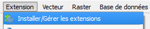
Figure 1  : le menu de gestion des extensions

- Se rendre dans l’onglet **Paramètres** et cliquer sur « Ajouter… »
- Ajouter le dépôt avec l’URL : **https://espacecollaboratif.ign.fr/plugins/plugin-qgis.xml**
	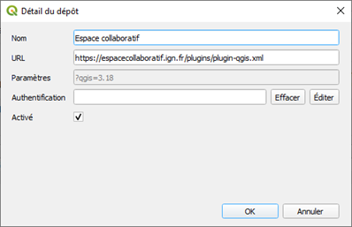
Figure 2  : configuration du dépôt d’extensions

- Une fois ajouté, s’assurer que les extensions expérimentales sont affichées et que le statut du dépôt Espace collaboratif est « connecté » :
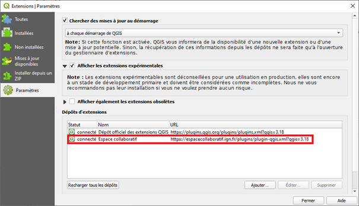
Figure 3 : Affichage des extensions expérimentales

- **IGN_Espace_collaboratif** apparait dans l’onglet **Nouvelles**. Il est possible de l’installer en cliquant sur «  Installer l’extension ». Il vous sera alors demandé de vous connecter en utilisant le login et le mot de passe de votre compte Espace collaboratif :
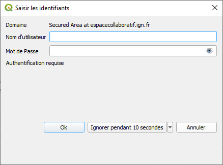
Figure 4 : Connexion au compte Espace collaboratif pour installation

- **IGN_Espace_collaboratif apparait alors dans la liste des extensions installées.**

Figure 5: Installation du plugin IGN_Espace_collaboratif

- La barre d’outils IGN_Espace_collaboratif est maintenant présente :
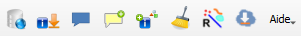
Figure 6 : la barre d'outils du plugin IGN_Espace_collaboratif dans QGIS

_Remarque  : Si elle n’apparait pas directement, aller dans «_  _Extensions > Installer/Gérer les extensions_  _», dans l’onglet «_  _Installées », désélectionner puis re-sélectionner la coche devant l’extension «_  _IGN_Espace_collaboratif »_

## 4.2 La barre d’outils IGN_Espace_collaboratif
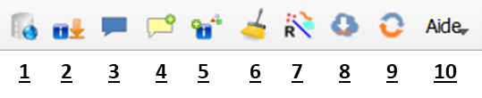
Figure 7 : la barre d'outils du plugin IGN_Espace_collaboratif dans QGIS

La barre d’outils du plugin IGN_Espace_collaboratif est composée des outils suivants :

-   **1**  Se connecter au service.
-   **2** Télécharger les signalements du service et les afficher sur la carte en cours.
-   **3** Visualiser le contenu d’un signalement (commentaire, réponses, document joint, croquis associés).
-   **4** Ajouter une nouvelle réponse à un signalement, qui sera envoyée à l’Espace collaboratif.
-   **5** Rédiger un nouveau signalement et l’envoyer à l’Espace collaboratif.
-   **6** Effacer, dans la carte courante, tous les objets signalements et croquis présents.
-   **7** Sélectionner les croquis associés à un ou plusieurs signalements, ou les signalements associés à un ou plusieurs croquis.
-   **8** Charger les couches paramétrées par le groupe de l’utilisateur s’il en a un.
-   **9** Mettre à jour les couches chargées dans QGIS à partir de l’Espace collaboratif.
-   **10** Dérouler le menu d’aide du plugin.

## 4.3 Les calques gérés par le plugin

Lors du premier chargement des signalements, le plugin ajoute dans la carte 6 couches destinées à contenir les différents objets IGN_Espace_collaboratif. Ces couches et leurs objets sont enregistrés dans une base de données SpatiaLite située dans le même dossier que celui de la carte qgz.

**Attention :** Si la carte QGIS contient encore la couche **Remarques_Ripart** (c’est-à-dire qu’il s’agit d’une carte commencée avec la version 1.2 du plugin), il faut supprimer cette couche avant de **télécharger les signalements.** Les 4 couches destinées à contenir les différents objets seront créés à nouveau lors du téléchargement.

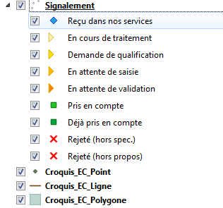
Figure 8  : Couches ajoutées par le plugin dans le projet QGIS

Ces couches dédiées se nomment :
-   **Signalement** : contient les signalements de l’Espace collaboratif sous forme de ponctuels. Les champs de cette couche stockent les différents attributs associés aux signalements.
-   **Croquis_EC_Point** : contient les croquis de type ponctuel.
-   **Croquis_EC_Ligne** : contient les croquis de type linéaire sous forme de polylignes.
-   **Croquis_EC_Polygone** : contient les croquis de type surfacique sous forme de polygones simples. 

Ces 4 couches utilisent le même système géographique de coordonnées que celui utilisé par le service Espace collaboratif (WGS84, coordonnées géographique en degrés décimaux). Néanmoins, l'utilisateur peut utiliser n’importe quel système géographique de coordonnées qui lui convient. Le plugin IGN_Espace_collaboratif et le SIG QGIS assurent de façon automatique et transparente le changement de projection à la volée et dans les deux sens.

Le plugin propose une symbologie par défaut pour les signalements en fonction de la valeur du champ statut[^1].

[^1]: Cf. Tableau 3 : Valeurs et signification des statuts

Cette symbologie est définie dans les fichiers **xx.qml** qui se trouvent dans le dossier **espacecoStyles**. Néanmoins, l’utilisateur peut utiliser tout autre symbologie à sa convenance.

## 4.4 Configuration du plugin

Pour son fonctionnement, le plugin stocke tous ses paramètres de configuration dans un fichier de type XML dénommé **espaceco.xml**. Ce dernier se situe dans le même dossier que celui qui contient le fichier projet QGIS (qgz).

Ce fichier étant nécessaire à son fonctionnement, le plugin le génère automatiquement s’il n’existe pas déjà. Le paramétrage du plugin se fait via la fenêtre de configuration qui s’ouvre depuis le menu **[Aide > Configurer le plugin]**  de la barre d'outils. Les nouveaux paramètres saisis sont ensuite automatiquement enregistrés dans ce fichier XML.

# 5. Utilisation

## 5.1 Connexion au service

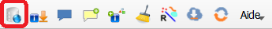

Toute interaction entre QGIS et le service nécessite une authentification auprès de ce dernier avec un compte utilisateur existant.

L’action de connexion au service est lancée automatiquement par le plugin avant chaque action en cas d'absence de connexion. Elle peut aussi être manuellement lancée par l'utilisateur en cliquant sur le bouton **Se connecter au service Espace collaboratif**.

Dans tous les cas, cela provoque l'ouverture d’une page web d’authentification.

**L’authentification via FranceConnect ou ProConnect n’est pas encore fonctionnelle.**

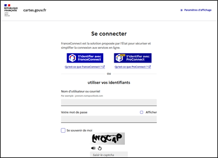

Figure 9  : Formulaire de connexion web au service Espace collaboratif

Les champs **Nom d’utilisateur ou courriel / Votre mot de passe** correspondent à votre login ou courriel / mot de passe de l’Espace Collaboratif.

Dans le cas où la connexion se passe bien :

1. vous avez la fenêtre web suivante, vous indiquant que vous pouvez fermer la fenêtre web et retourner dans QGIS :
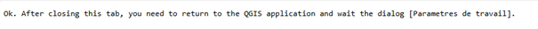 
2. suivi, par la fenêtre de paramétrage QGIS du groupe et de l’emprise.
 

La fermeture de QGIS interrompt la connexion au service. Il faut donc la rétablir lors de l’utilisation suivante du SIG.

**Note :** En cas d’échec de la connexion (message : « la connexion a échoué »), il peut s’agir d’un problème d’accès au serveur dû au proxy. Il peut être nécessaire de spécifier un proxy dans la configuration du plugin (menu Aide du plugin > Configurer le proxy), cf. §5.12. Attention, la définition d’un proxy dans l’interface de QGIS (menu Préférences > Options > Réseau) ne suffit pas. Une autre solution consiste à définir des variables d’environnement HTTP_PROXY et HTTPS_PROXY avec les valeurs ad-hoc (dépendant de votre établissement) peut régler le problème.

###  5.1.1  Cas d'un utilisateur appartenant à aucun groupe

Au clic sur le bouton « Connecter », une fenêtre de confirmation apparaît :
 
Figure 10  : Fenêtre de confirmation de connexion pour un utilisateur sans groupe

### 5.1.2  Cas d’un utilisateur appartenant à au moins un groupe

Au clic sur le bouton « Connecter », une nouvelle fenêtre permettant de paramétrer l’utilisation du plugin apparaît :
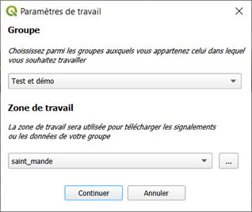 
Figure 13  : Fenêtre de paramétrage du groupe

- Si l’utilisateur appartient à plusieurs groupes, un menu déroulant lui permet de choisir celui dans lequel il souhaite travailler. S’il n’appartient qu’à un seul groupe, celui-ci est sélectionné par défaut.

- L’utilisateur peut choisir sa zone de travail en utilisant le menu déroulant pour sélectionner une couche surfacique déjà présente dans la carte ou le bouton parcourir pour sélectionner un fichier shape sur l’ordinateur.

Après avoir cliqué sur le bouton « Enregistrer », une fenêtre de confirmation de connexion, reprenant le paramétrage choisi par l’utilisateur, est affichée :
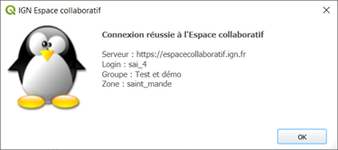
Figure 12 : Fenêtre de confirmation de connexion pour un utilisateur avec groupe

## 5.2 Import des signalements

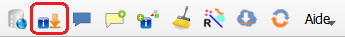
Cliquer sur le bouton **Télécharger les signalements** pour lancer la procédure de téléchargement des signalements depuis l’espace collaboratif IGN.

La procédure efface préalablement tous les objets des calques spécifiques au fonctionnement du plugin IGN_Espace_collaboratif présents sur la carte. Les signalements importés sont mis dans le calque **Signalement**. Lorsqu’ils sont accompagnés de croquis, ces derniers sont importés dans les différents calques **Croquis_EC**.

Le plugin propose dans le formulaire de configuration, deux options pour filtrer[^2] l'import des signalements selon les besoins de l'utilisateur :

[^2]: Il existe également un filtrage thématique paramétrable sur l’espace collaboratif pour importer des signalements sur des thèmes précis.

-   Le **filtrage spatial** : on choisit le calque contenant l’emprise à utiliser pour filtrer les signalements à importer.
-   Le **filtrage chronologique** : l’utilisateur précise une date et seuls les signalements mis à jour depuis cette date seront importés.
-   Le **filtrage selon le groupe** :
	-   Les utilisateurs ayant sélectionnés un groupe dans la fenêtre de paramétrage, ne téléchargeront que les signalements de leur groupe.
	-   Les utilisateurs sans groupe, auront accès aux signalements accessibles depuis la route https://espacecollaboratif.ign.fr/gcms/api/reports.

L'import de tous les signalements depuis le service Espace collaboratif peut prendre un certain temps en fonction du nombre de signalements et de la qualité de la connexion réseau. C'est pourquoi il est judicieux d'utiliser les options de filtrage pour limiter le nombre de signalements à télécharger.

À l'issue du téléchargement, une fenêtre annonce le succès de l'opération et détaille la répartition des signalements importés selon leur statut.
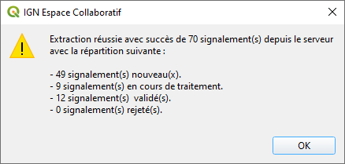
Figure 13 : Fenêtre annonçant la réussite du téléchargement des signalements depuis l’Espace collaboratif

