
# Plugin IGN_Espace_collaboratif pour QGIS

## Version 5.0
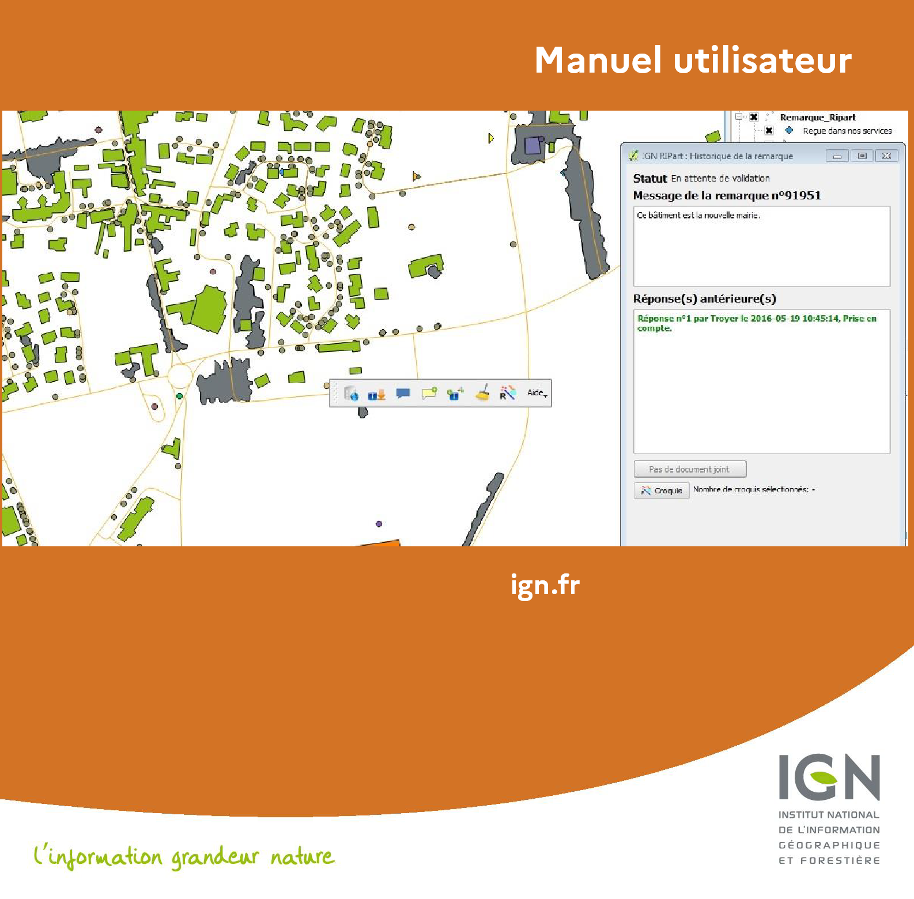 


<div  style="background-color: white; border: 1px solid black; padding: 3px; text-align: justify;">
  <h2 style="color: #00ADC5">1. Sommaire</h2>
</div>

- [1. Sommaire](#1-sommaire)
- [2. Versions](#2-versions)
- [3. Préambule](#3-préambule)
  - [3.1 Présentation du service](#31-présentation-du-service)
    - [Signalement](#signalement)
    - [Contribution directe](#contribution-directe)
  - [3.2 Rôle du plugin Espace collaboratif pour QGIS](#32-rôle-du-plugin-espace-collaboratif-pour-qgis)
  - [3.3 Prérequis](#33-prérequis)
- [4. Installation et principes de fonctionnement](#4-installation-et-principes-de-fonctionnement)
  - [4.1 Procédure d'installation](#41-procédure-dinstallation)
  - [4.2 La barre d'outils IGN_Espace_collaboratif](#42-la-barre-doutils-ign_espace_collaboratif)
  - [4.3 Les calques gérés par le plugin](#43-les-calques-gérés-par-le-plugin)
  - [4.4 Configuration du plugin](#44-configuration-du-plugin)
- [5. Utilisation](#5-utilisation)
  - [5.1 Connexion au service](#51-connexion-au-service)
    - [5.1.1 Cas d'un utilisateur appartenant à aucun groupe](#511-cas-dun-utilisateur-appartenant-à-aucun-groupe)
    - [5.1.2 Cas d'un utilisateur appartenant à au moins un groupe](#512-cas-dun-utilisateur-appartenant-à-au-moins-un-groupe)
  - [5.2 Import des signalements](#52-import-des-signalements)
  - [5.3 Visualisation d'un signalement](#53-visualisation-dun-signalement)
  - [5.4 Déplacer un signalement](#54-déplacer-un-signalement)
  - [5.5 Visualisation des attributs d'un croquis](#55-visualisation-des-attributs-dun-croquis)
  - [5.6 Répondre à un signalement](#56-répondre-à-un-signalement)
  - [5.7 Création d'un nouveau signalement](#57-création-dun-nouveau-signalement)
  - [5.8 Nettoyage de la carte](#58-nettoyage-de-la-carte)
  - [5.9 Visualiser les objets associés](#59-visualiser-les-objets-associés)
  - [5.10 Charger les couches de son groupe actif](#510-charger-les-couches-de-son-groupe-actif)
  - [5.11 Editer les couches du groupe (contribution directe)](#511-editer-les-couches-du-groupe-contribution-directe)
  - [5.12 Mettre à jour les couches Espace collaboratif](#512-mettre-à-jour-les-couches-espace-collaboratif)
  - [5.13 Configurer le plugin IGN_Espace_collaboratif](#513-configurer-le-plugin-ign_espace_collaboratif)
  - [5.14 Accéder au manuel utilisateur](#514-accéder-au-manuel-utilisateur)
  - [5.15 Afficher le fichier journal du plugin](#515-afficher-le-fichier-journal-du-plugin)
  - [5.16 Le menu À propos du plugin IGN_Espace_collaboratif](#516-le-menu-à-propos-du-plugin-ign_espace_collaboratif)
  - [5.17 Changement d'utilisateur ou de groupe](#517-changement-dutilisateur-ou-de-groupe)
- [6. Annexes](#6-annexes)
  - [6.1 Tableau 1 : champs du calque Signalement](#61-tableau-1--champs-du-calque-signalement)
  - [6.2 Tableau 2 : champs des calques Croquis_EC](#62-tableau-2--champs-des-calques-croquis_ec)
  - [6.3 Tableau 3 : Valeurs et signification des statuts d'un signalement](#63-tableau-3--valeurs-et-signification-des-statuts-dun-signalement)
  - [6.4 Formats acceptés pour les documents joints](#64-formats-acceptés-pour-les-documents-joints)
  - [6.5 Fichiers nécessaires au fonctionnement du plugin](#65-fichiers-nécessaires-au-fonctionnement-du-plugin)
  - [6.6 Exemple de contenu du fichier de configuration espaceco.xml](#66-exemple-de-contenu-du-fichier-de-configuration-espacecoxml)

---
<div  style="background-color: white; border: 1px solid black; padding: 3px; text-align: justify;">
  <h2 style="color: #00ADC5">2. Versions</h2>
</div>

| Numéro | Commentaire  | Date |
|--|--|--|
| 1.0 |Première version du manuel utilisateur  |24/05/2016|
|1.1|Version du manuel utilisateur 1.1|28/06/2016|
|1.2|Modification des instructions d’installation du plugin|22/11/2016|
|2.0|Gestion des attributs de thèmes|19/12/2017|
||Changement de vocabulaire pour les signalements||
||Version du manuel utilisateur 2.0||
|3.0.1|Compatibilité avec QGIS 3|15/03/2019|
||Changement des couches croquis||
||Changement du nom du plugin en IGN_Espace_collaboratif||
||Version du manuel utilisateur 3.0||
|3.0.7|Révision pour déploiement du patch correctif 3.0.7|24/03/2020|
|4.0|Ajout du chargement et de l’édition de guichets|08/01/2021|
||Ajout du chargement des couches Géoportail des groupes||
||Correction de divers bugs||
|4.1|Diffusion sur l’Espace collaboratif|01/02/2022|
||Suppression du système de clés Géoportail||
|4.1.1|Adaptation du processus d’installation|11/02/2022|
|4.2.0|Mise à jour suite à l’ajout de la contribution directe à la BDUni|28/06/2023|
||Corrections diverses||
|4.2.1/4.2.2|Mise à jour des explications sur l’utilisation du proxy|06/07/2023|
|4.3.0|Évolution de la fenêtre de choix du groupe|26/08/2025|
|5.0|Branchement sur la nouvelle API Espace Co|03/11/2025|
||Connexion modifiée||
||Signalement sans obligation de sélectionner un objet.||
||Déplacer un signalement||
||Évolution filtrage des signalements selon le groupe.||
||Contribution directe : Ajout de contraintes entre champs||
||Corrections diverses||


<div  style="background-color: white; border: 1px solid black; padding: 3px; text-align: justify;">
  <h2 style="color: #00ADC5">3. Préambule</h2>
</div>

### <span style="color: white; background-color: #00ADC5; padding: 2px 5px;  width: 100%;">3.1 Présentation du service             </span>


L’Espace collaboratif de l’IGN ([https://espacecollaboratif.ign.fr](https://espacecollaboratif.ign.fr)) propose deux services principaux :

 - un service de signalement,
 - un service d’hébergement et de contribution à des bases de données, métiers ou IGN.

#### <span style="color: #00ADC5">Signalement</span>
Le service de signalement de l’IGN (anciennement remontées d’information partagées RIPart) est un service offert par l’Institut national de l’information géographique et forestière (IGN) pour permettre à ses partenaires institutionnels de lui transmettre, de façon automatique et normalisée, des remarques concernant les données de l’Institut et qui nécessiteraient une correction ou une mise-à-jour. Ce service peut également être utilisé par les partenaires pour leurs propres besoins (mise à jour de données métiers, non destinées à l’IGN).

Chaque nouveau signalement sur une donnée IGN donne lieu à un traitement hiérarchisé au sein du service de l’IGN concerné par la remarque, qui y apportera des réponses officielles.

Un signalement contient :

-   **Une position géographique** pour situer le signalement ;
-   **Un commentaire** rédigé par l'auteur du signalement à l'adresse de l'IGN pour expliquer l’objet de son signalement ;
-   **Un statut** pour situer le signalement dans la chaîne de traitement (reçu dans nos services, en cours de traitement, pris en compte…) ;
-   Éventuellement **un thème** associé pour définir la thématique IGN et/ou la thématique métier concernées par le signalement. Il est à noter que les signalements sans thème auront le statut ‘en demande de qualification’ tant qu’ils n’auront pas un thème associé.
-   Éventuellement un ou plusieurs attributs liés au thème ;
-   Éventuellement des objets géométriques (ponctuels, linéaires, surfaciques) composant **un croquis** joint à ce signalement. Certains attributs de ce croquis peuvent aussi être joints au signalement ;
-   Éventuellement **de 1 à 4 fichiers joints** de formats divers (pdf, doc, images…).

Chaque signalement, sauf s’il est lié à un groupe ne partageant pas ses signalements, est accessible en consultation à tous les utilisateurs sur l’Espace collaboratif. Il y possède une fiche où tous ces éléments sont visibles ainsi que les réponses apportées par l’IGN.

#### <span style="color: #00ADC5">Contribution directe</span>

L’IGN offre également à ses partenaires la possibilité d’héberger leurs données dans une base de données stockée sur l’Espace collaboratif. L’Espace collaboratif propose alors un ensemble d’outils de gestion de ces bases ainsi que des outils permettant d’entretenir et de mettre à jour les données qu’elles contiennent. On parle alors de fonctionnalités de contribution directe, accessibles depuis un « guichet » de l’Espace collaboratif.


### <span style="color: white; background-color: #00ADC5; padding: 2px 5px; text-align: justify;">3.2 Rôle du plugin Espace collaboratif pour QGIS</span>
Le plugin IGN_Espace_collaboratif est une extension pour le logiciel QGIS, qui permet depuis le SIG d'interagir directement avec le service Espace collaboratif (sans passer par le site web [espacecollaboratif.ign.fr](https://espacecollaboratif.ign.fr)).

L'utilisateur peut ainsi depuis QGIS :
 - Importer, dans sa carte courante, l'ensemble des signalements d'un lieu donné ;
 - Consulter le contenu des signalements présents sur la carte ;
 - Leur ajouter une réponse (s’il en a la permission) ;
 - Créer de nouveaux signalements qui seront transmis au service concerné.
 - Pour les utilisateurs appartenant à un groupe disposant de permissions d’écriture sur une base de données accessible sur l’Espace collaboratif via un guichet :
	- Afficher les couches paramétrées dans la carte de son groupe dans QGIS.
	- Éditer les données et les enregistrer dans la base Espace collaboratif correspondante.

L'intégration du plugin dans le SIG se traduit visuellement par l’ajout d’une barre d'outils supplémentaire dédiée aux fonctionnalités du plugin, et par des couches ajoutées à la carte active et qui sont destinées à contenir les différents objets provenant de l’Espace collaboratif (ses signalements et croquis associés, couches du groupe).

### <span style="color: white; background-color: #00ADC5; padding: 2px 5px; width: 100%;">3.3 Prérequis</span>

Le plugin IGN_Espace_collaboratif pour QGIS requiert la configuration minimum suivante :
-   Windows
-   Une connexion internet permanente (afin que le plugin puisse communiquer avec le serveur de l’Espace collaboratif).
-   Le SIG QGIS, version 3.x .

L'utilisation du plugin IGN_Espace_collaboratif nécessite de posséder un compte utilisateur sur le site [espacecollaboratif.ign.fr](https://espacecollaboratif.ign.fr). L’inscription à un groupe d’utilisateurs est ouverte ; l’affiliation à un groupe d’utilisateurs est en revanche soumise à acceptation par le ou les gestionnaires de ce groupe, et permet de déterminer le niveau de permission de l’utilisateur.

Le plugin IGN_Espace_collaboratif ne fonctionne qu'en association avec un projet QGIS au format qgz. C'est à partir de cette carte que le plugin va ajouter ses propres couches qui seront stockées parallèlement au fichier qgz dans une base de données SpatiaLite. C'est aussi dans ce même dossier que doit se situer le fichier de configuration du plugin **<span style="font-family: Consolas, monospace; color:#00B050">espaceco.xml</span>**, qui est créé automatiquement par le plugin lors de la première utilisation.

NB : le nom du projet QGIS dans lequel sera utilisé le plugin Espace collaboratif ne doit pas contenir de point en dehors de son extension (.qgz).


<div  style="background-color: white; border: 1px solid black; padding: 3px; text-align: justify;">
  <h2 style="color: #00ADC5">4. Installation et principes de fonctionnement</h2>
</div>

### <span style="color: white; background-color: #00ADC5; padding: 2px 5px; width: 100%;">4.1 Procédure d'installation</span>

Pour installer le plugin, suivre les étapes suivantes :
- Ouvrir QGIS et se rendre dans le menu **Extension** > **Installer/Gérer les extensions**

<div  style="text-align: center;"> 
	 
	<p><strong><span style="color: #548DD4">Figure 1 : le menu de gestion des extensions</span></strong></p>
</div>

- Se rendre dans l’onglet **Paramètres** et cliquer sur « Ajouter… »
- Ajouter le dépôt avec l’URL : **https://espacecollaboratif.ign.fr/plugins/plugin-qgis.xml**

<div  style="text-align: center;"> 
	
  <p><strong><span style="color: #548DD4">Figure 2  : configuration du dépôt d’extensions</span></strong></p>
</div>

- Une fois ajouté, s’assurer que les extensions expérimentales sont affichées et que le statut du dépôt Espace collaboratif est « connecté » :

<div  style="text-align: center;"> 
	
  <p><strong><span style="color: #548DD4">Figure 3 : Affichage des extensions expérimentales</span></strong></p>
</div>

- **IGN_Espace_collaboratif** apparait dans l’onglet **Nouvelles**. Il est possible de l’installer en cliquant sur «  Installer l’extension ». Il vous sera alors demandé de vous connecter en utilisant le login et le mot de passe de votre compte Espace collaboratif :

<div  style="text-align: center;"> 
	
  <p><strong><span style="color: #548DD4">Figure 4 : Connexion au compte Espace collaboratif pour installation</span></strong></p>
</div>

- **IGN_Espace_collaboratif apparait alors dans la liste des extensions installées.**
	
<div  style="text-align: center;"> 
	
  <p><strong><span style="color: #548DD4">Figure 5: Installation du plugin IGN_Espace_collaboratif</span></strong></p>
</div>

- La barre d’outils IGN_Espace_collaboratif est maintenant présente :
	
<div  style="text-align: center;"> 
	
  <p><strong><span style="color: #548DD4">Figure 6 : la barre d'outils du plugin IGN_Espace_collaboratif dans QGIS</span></strong></p>
</div>

_Remarque  : Si elle n’apparait pas directement, aller dans « Extensions > Installer/Gérer les extensions », dans l’onglet « Installées », désélectionner puis re-sélectionner la coche devant l’extension « IGN_Espace_collaboratif »_


### <span style="color: white; background-color: #00ADC5; padding: 2px 5px; width: 100%;">4.2 La barre d’outils IGN_Espace_collaboratif</span>

<div  style="text-align: center;"> 
	 
	<p><strong><span style="color: #548DD4">Figure 7 : la barre d'outils du plugin IGN_Espace_collaboratif dans QGIS</span></strong></p>
</div>


La barre d’outils du plugin IGN_Espace_collaboratif est composée des outils suivants :

-   **1**  Se connecter au service.
-   **2** Télécharger les signalements du service et les afficher sur la carte en cours.
-   **3** Visualiser le contenu d’un signalement (commentaire, réponses, document joint, croquis associés).
-   **4** Ajouter une nouvelle réponse à un signalement, qui sera envoyée à l’Espace collaboratif.
-   **5** Rédiger un nouveau signalement et l’envoyer à l’Espace collaboratif.
-   **6** Effacer, dans la carte courante, tous les objets signalements et croquis présents.
-   **7** Sélectionner les croquis associés à un ou plusieurs signalements, ou les signalements associés à un ou plusieurs croquis.
-   **8** Charger les couches paramétrées par le groupe de l’utilisateur s’il en a un.
-   **9** Mettre à jour les couches chargées dans QGIS à partir de l’Espace collaboratif.
-   **10** Dérouler le menu d’aide du plugin.

### <span style="color: white; background-color: #00ADC5; padding: 2px 5px; width: 100%;">4.3 Les calques gérés par le plugin</span>

Lors du premier chargement des signalements, le plugin ajoute dans la carte 6 couches destinées à contenir les différents objets IGN_Espace_collaboratif. Ces couches et leurs objets sont enregistrés dans une base de données SpatiaLite située dans le même dossier que celui de la carte qgz.

**Attention :** Si la carte QGIS contient encore la couche **<span style="color:#00B050">Remarques_Ripart</span>**  (c’est-à-dire qu’il s’agit d’une carte commencée avec la version 1.2 du plugin), il faut supprimer cette couche avant de  **<span style="color:#00B050">télécharger les signalements.</span>** Les 4 couches destinées à contenir les différents objets seront créés à nouveau lors du téléchargement.

<div  style="text-align: center;"> 
	
  <p><strong><span style="color: #548DD4">Figure 8  : Couches ajoutées par le plugin dans le projet QGIS</span></strong></p>
</div>

Ces couches dédiées se nomment :
-   **<span style="color:#00B050">Signalement</span>** : contient les signalements de l’Espace collaboratif sous forme de ponctuels. Les champs de cette couche stockent les différents attributs associés aux signalements.
-   **<span style="color:#00B050">Croquis_EC_Point</span>** : contient les croquis de type ponctuel.
-   **<span style="color:#00B050">Croquis_EC_Ligne</span>** : contient les croquis de type linéaire sous forme de polylignes.
-   **<span style="color:#00B050">Croquis_EC_Polygone</span>** : contient les croquis de type surfacique sous forme de polygones simples. 

Ces 4 couches utilisent le même système géographique de coordonnées que celui utilisé par le service Espace collaboratif (WGS84, coordonnées géographiques en degrés décimaux). Néanmoins, l'utilisateur peut utiliser n’importe quel système géographique de coordonnées qui lui convient. Le plugin IGN_Espace_collaboratif et le SIG QGIS assurent de façon automatique et transparente le changement de projection à la volée et dans les deux sens.

Le plugin propose une symbologie par défaut pour les signalements en fonction de la valeur du champ statut[^1].

[^1]: Cf. Tableau 3 : Valeurs et signification des statuts

Cette symbologie est définie dans les fichiers **<span style="font-family: Consolas, monospace; color:#00B050">xx.qml</span>** qui se trouvent dans le dossier **<span style="font-family: Consolas, monospace; color:#00B050">espacecoStyles</span>**. Néanmoins, l’utilisateur peut utiliser tout autre symbologie à sa convenance.

### <span style="color: white; background-color: #00ADC5; padding: 2px 5px; width: 100%;">4.4 Configuration du plugin</span>

Pour son fonctionnement, le plugin stocke tous ses paramètres de configuration dans un fichier de type XML dénommé **<span style="font-family: Consolas, monospace; color:#00B050">espaceco.xml</span>**. Ce dernier se situe dans le même dossier que celui qui contient le fichier projet QGIS (qgz).

Ce fichier étant nécessaire à son fonctionnement, le plugin le génère automatiquement s’il n’existe pas déjà. Le paramétrage du plugin se fait via la fenêtre de configuration qui s’ouvre depuis le menu **<span style="font-family: Consolas, monospace; color:#0000FF">[Aide > Configurer le plugin]</span>**  de la barre d'outils. Les nouveaux paramètres saisis sont ensuite automatiquement enregistrés dans ce fichier XML.

<div  style="background-color: white; border: 1px solid black; padding: 3px; text-align: justify;">
  <h2 style="color: #00ADC5">5. Utilisation</h2>
</div>


### <span style="color: white; background-color: #00ADC5; padding: 2px 5px; width: 100%;">5.1 Connexion au service</span><span style="color: red"> - Modifié !</span>

<div  style="text-align: center;"> 
	
</div>

Toute interaction entre QGIS et le service nécessite une authentification auprès de ce dernier avec un compte utilisateur existant.

L’action de connexion au service est lancée automatiquement par le plugin avant chaque action en cas d'absence de connexion. Elle peut aussi être manuellement lancée par l'utilisateur en cliquant sur le bouton **<span style="font-family: Consolas, monospace; color:#0000FF">Se connecter au service Espace collaboratif</span>**.

Dans tous les cas, cela provoque l'ouverture d’une page web d’authentification.

**L’authentification via FranceConnect ou ProConnect n’est pas encore fonctionnelle.**

<div  style="text-align: center;"> 
	
  <p><strong><span style="color: #548DD4">Figure 9  : Formulaire de connexion web au service Espace collaboratif</span></strong></p>
</div>

Les champs **<span style="font-family: Consolas, monospace; color:#0000FF">Nom d’utilisateur ou courriel / Votre mot de passe</span>** correspondent à votre login ou courriel / mot de passe de l’Espace Collaboratif.

Dans le cas où la connexion se passe bien :

1. vous avez la fenêtre web suivante, vous indiquant que vous pouvez fermer la fenêtre web et retourner dans QGIS :

<div  style="text-align: center;"> 
	
</div>

2. suivi, par la fenêtre de paramétrage QGIS du groupe et de l’emprise.

<div  style="text-align: center;"> 
	
</div>

La fermeture de QGIS interrompt la connexion au service. Il faut donc la rétablir lors de l’utilisation suivante du SIG.

**Note :** En cas d’échec de la connexion (message : « la connexion a échoué »), il peut s’agir d’un problème d’accès au serveur dû au proxy. Il peut être nécessaire de spécifier un proxy dans la configuration du plugin (menu Aide du plugin > Configurer le proxy), cf. §5.12. Attention, la définition d’un proxy dans l’interface de QGIS (menu Préférences > Options > Réseau) ne suffit pas. Une autre solution consiste à définir des variables d’environnement HTTP_PROXY et HTTPS_PROXY avec les valeurs ad-hoc (dépendant de votre établissement) peut régler le problème.

#### <span style="color: #00ADC5">5.1.1 Cas d'un utilisateur appartenant à aucun groupe</span>

Au clic sur le bouton « Connecter », une fenêtre de confirmation apparaît :

<div  style="text-align: center;"> 
	
  <p><strong><span style="color: #548DD4">Figure 10  : Fenêtre de confirmation de connexion pour un utilisateur sans groupe</span></strong></p>
</div>

#### <span style="color: #00ADC5">5.1.2 Cas d’un utilisateur appartenant à au moins un groupe</span>

Au clic sur le bouton « Connecter », une nouvelle fenêtre permettant de paramétrer l’utilisation du plugin apparaît :

<div  style="text-align: center;"> 
	
  <p><strong><span style="color: #548DD4">Figure 11  : Fenêtre de paramétrage du groupe</span></strong></p>
</div>

- Si l’utilisateur appartient à plusieurs groupes, un menu déroulant lui permet de choisir celui dans lequel il souhaite travailler. S’il n’appartient qu’à un seul groupe, celui-ci est sélectionné par défaut.

- L’utilisateur peut choisir sa zone de travail en utilisant le menu déroulant pour sélectionner une couche surfacique déjà présente dans la carte ou le bouton parcourir pour sélectionner un fichier shape sur l’ordinateur.

Après avoir cliqué sur le bouton « Enregistrer », une fenêtre de confirmation de connexion, reprenant le paramétrage choisi par l’utilisateur, est affichée :

<div  style="text-align: center;"> 
	
  <p><strong><span style="color: #548DD4">Figure 12 : Fenêtre de confirmation de connexion pour un utilisateur avec groupe</span></strong></p>
</div>


### <span style="color: white; background-color: #00ADC5; padding: 2px 5px; width: 100%;">5.2 Import des signalements</span>

<div  style="text-align: center;"> 
	
</div>

Cliquer sur le bouton **<span style="font-family: Consolas, monospace; color:#0000FF">Télécharger les signalements</span>** pour lancer la procédure de téléchargement des signalements depuis l’espace collaboratif IGN.

La procédure efface préalablement tous les objets des calques spécifiques au fonctionnement du plugin IGN_Espace_collaboratif présents sur la carte. Les signalements importés sont mis dans le calque **<span style="font-family: Consolas, monospace; color:#00B050">Signalement</span>**. Lorsqu’ils sont accompagnés de croquis, ces derniers sont importés dans les différents calques **<span style="font-family: Consolas, monospace; color:#00B050">Croquis_EC</span>**.

Le plugin propose dans le formulaire de configuration, deux options pour filtrer[^2] l'import des signalements selon les besoins de l'utilisateur :

[^2]: Il existe également un filtrage thématique paramétrable sur l’espace collaboratif pour importer des signalements sur des thèmes précis.

-   Le **filtrage spatial** : on choisit le calque contenant l’emprise à utiliser pour filtrer les signalements à importer.
-   Le **filtrage chronologique** : l’utilisateur précise une date et seuls les signalements mis à jour depuis cette date seront importés.
-   Le **filtrage selon le groupe** :
	-   Les utilisateurs ayant sélectionnés un groupe dans la fenêtre de paramétrage, ne téléchargeront que les signalements de leur groupe.
	-   Les utilisateurs sans groupe, auront accès aux signalements accessibles depuis la route https://espacecollaboratif.ign.fr/gcms/api/reports.

L'import de tous les signalements depuis le service Espace collaboratif peut prendre un certain temps en fonction du nombre de signalements et de la qualité de la connexion réseau. C'est pourquoi il est judicieux d'utiliser les options de filtrage pour limiter le nombre de signalements à télécharger.

À l'issue du téléchargement, une fenêtre annonce le succès de l'opération et détaille la répartition des signalements importés selon leur statut.

<div  style="text-align: center;"> 
	
  <p><strong><span style="color: #548DD4">Figure 13 : Fenêtre annonçant la réussite du téléchargement des signalements depuis l’Espace collaboratif</span></strong></p>
</div>

### <span style="color: white; background-color: #00ADC5; padding: 2px 5px; width: 100%;">5.3 Visualisation d'un signalement</span>

<div  style="text-align: center;"> 
	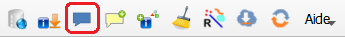
</div>

Sélectionner un signalement sur la carte, puis cliquer sur le bouton **<span style="color:#0000FF">Voir le signalement</span>**.
Une fenêtre avec le message du signalement et les éventuelles réponses s’ouvre :

<div  style="text-align: center;"> 
	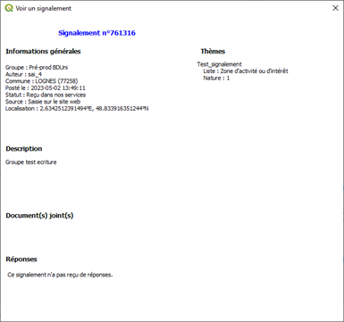
  <p><strong><span style="color: #548DD4">Figure 14  : Fiche d’un signalement</span></strong></p>
</div>

### <span style="color: white; background-color: #00ADC5; padding: 2px 5px; width: 100%;">5.4 Déplacer un signalement</span>

<div  style="text-align: center;"> 
	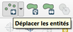
</div>

Pour déplacer un signalement, il faut utiliser l’outil standard de QGIS après avoir passé la couche en mode édition.

<div  style="text-align: center;"> 
	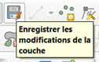
</div>

Après le déplacement effectif du signalement, la sauvegarde est active. Il suffit de cliquer sur la disquette pour envoyer la mise à jour vers le serveur de l’espace collaboratif.

Un message de fin indique le résultat du déplacement :

<div  style="text-align: center;"> 
	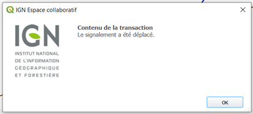
</div>

### <span style="color: white; background-color: #00ADC5; padding: 2px 5px; width: 100%;">5.5 Visualisation des attributs d'un croquis</span>

Lorsqu’un croquis joint à un signalement a des attributs, ceux-ci peuvent être consultés via la fonction « identifier les entités » de QGIS.

<div  style="text-align: center;"> 
	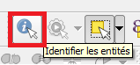
  <p><strong><span style="color: #548DD4">Figure 15  : Accès aux attributs d’un croquis</span></strong></p>
</div>

<div  style="text-align: center;"> 
	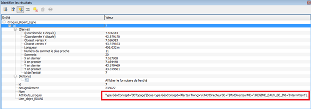
  <p><strong><span style="color: #548DD4">Figure 16  : Exemple d’attributs liés à un croquis</span></strong></p>
</div>

### <span style="color: white; background-color: #00ADC5; padding: 2px 5px; width: 100%;">5.6 Répondre à un signalement</span>

<div  style="text-align: center;"> 
	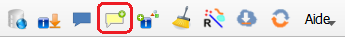
</div>

Il est possible de répondre à un ou plusieurs signalements simultanément.

Pour ajouter une réponse : sélectionner au moins un signalement sur la carte, puis cliquer sur le bouton **<span style="font-family: Consolas, monospace; color:#0000FF">Répondre à un signalement</span>**.

Le formulaire de réponse à un ou plusieurs signalements permet d’inclure un texte et d’attribuer un nouveau statut au(x) signalement(s) sélectionné(s) :

<div  style="text-align: center;"> 
	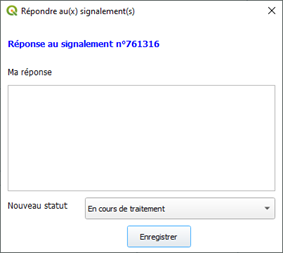
  <p><strong><span style="color: #548DD4">Figure 17  : Formulaire de réponse à un signalement</span></strong></p>
</div>

Si plusieurs signalements sont sélectionnés, la même réponse et le même statut leur seront affectés.


### <span style="color: white; background-color: #00ADC5; padding: 2px 5px; width: 100%;">5.7 Création d'un nouveau signalement</span>

<u>Note</u> : avant la création d‘un signalement, il est indispensable d’avoir préalablement chargé une première fois les signalements (cf. 5.2).

<div  style="text-align: center;"> 
	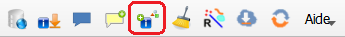
</div>

Sélectionner un ou plusieurs objets sur la carte, puis cliquer sur le bouton **<span style="font-family: Consolas, monospace; color:#0000FF">Créer un nouveau signalement</span>**. **Il est désormais possible de créer un signalement sans sélectionner d’objet dans la carte**

Les objets sélectionnés seront transformés en croquis pour l’Espace collaboratif et joints au nouveau signalement si l'option idoine est activée. C’est aussi à partir de ces objets sélectionnés que le plugin détermine la position géographique du signalement à créer (situé au centroïde des objets sélectionnés).

Le formulaire suivant permet de :

- choisir dans quel groupe (parmi les groupes de l’utilisateur) est créé le signalement ;
- rédiger un commentaire ou utiliser le commentaire par défaut défini par le groupe ;
- sélectionner le/les thèmes concernés par le signalement ;
- Remplir les éventuels attributs du ou des thèmes sélectionnés ;
- joindre un croquis (l’option « joindre un croquis » est cochée par défaut, et détermine s'il faut joindre au nouveau signalement le (ou les) croquis généré(s) à partir des objets sélectionnés)
- joindre un document : la taille du fichier ne doit pas excéder 5 Mo, les formats autorisés sont listés dans l’annexe 5.3 ;
- créer un ou plusieurs signalement(s) : dans le premier cas (sélectionné par défaut), un signalement unique est créé et positionné sur le centroïde de l’ensemble des objets sélectionnés. Dans le second cas, il est créé un nouveau signalement par objet sélectionné, avec pour position, à chaque fois, le centroïde de l’objet.

<div  style="text-align: center;"> 
	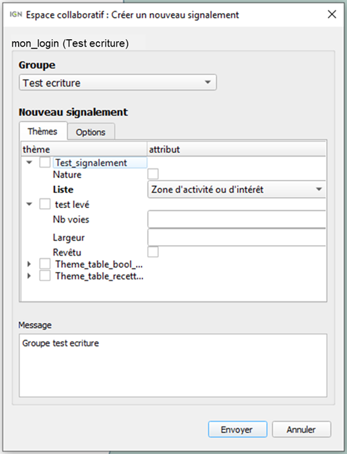  
  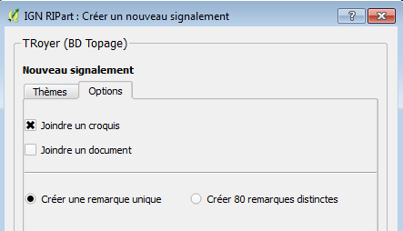
  <p><strong><span style="color: #548DD4">Figure 18 : Formulaires de création de nouveaux signalements</span></strong></p>
</div>

Un message informe du succès de l'envoi vers l’Espace collaboratif du nouveau signalement, puis celui-ci est affiché sur la carte.

**<span style="color:red">Nouveau !</span>**  **La gestion de l’interface utilisateur a été améliorée**. Le dialogue se ferme uniquement si le remplissage du thème, du commentaire et des options est correct.

Si un attribut obligatoire du thème n’est pas rempli, il apparait en rouge

Exemple :

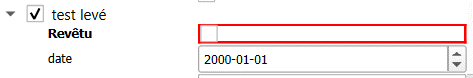


Et un message affiche

**_NB : la coche ou le remplissage d’un attribut entraine la coche automatique du Thème_**

**<span style="color:red">Nouveau !</span>** **Un signalement peut être créé sans obligation de sélectionner un objet**. La fonctionnalité est active si la couche Signalement est passée en mode édition.

<div  style="text-align: center;"> 
	
</div>

Si aucun objet n’est sélectionné, le clic sur le bouton entraine un changement d’apparence du curseur qui se transforme en croix noire. Un clic entraine le dessin d’un carré rouge à l’emplacement du pointé sur la carte et l’ouverture du dialogue « Créer un nouveau signalement » La procédure est ensuite la même avec le choix du thème et des options.

<div  style="text-align: center;"> 
	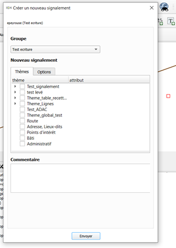
</div>

Si tout s’est bien passé, un message affiche

<div  style="text-align: center;"> 
	
</div>

Le signalement est toujours matérialisé par un point rouge mais celui-ci prendra son apparence définitive dès la fermeture du message de fin.

### <span style="color: white; background-color: #00ADC5; padding: 2px 5px; width: 100%;">5.8 Nettoyage de la carte</span>

<div  style="text-align: center;"> 
	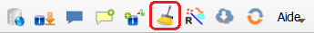
</div>

Cliquer sur le bouton **<span style="font-family: Consolas, monospace; color:#0000FF">Supprimer les signalements de la carte en cours</span>**  provoque la suppression sur la carte en cours de tous les objets IGN_Espace_collaboratif (signalements et croquis) qu'elle contenait.

Les autres données présentes dans la carte ne sont pas affectées par l'opération.

Les signalements et croquis ne sont pas supprimés sur l’Espace collaboratif.

### <span style="color: white; background-color: #00ADC5; padding: 2px 5px; width: 100%;">5.9 Visualiser les objets associés</span>

<div  style="text-align: center;"> 
	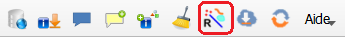
</div>

Cet outil (baguette magique) permet de sélectionner sur la carte tous les croquis associés à un ou plusieurs signalements, ou inversement, tous les signalements associés à un ou plusieurs croquis.

**Exemple :**

On sélectionne deux signalements (en jaune), puis on clique sur le bouton **<span style="font-family: Consolas, monospace; color:#0000FF">Voir les objets associés</span>**. Tous les croquis associés aux deux signalements sont alors sélectionnés

<div  style="text-align: center;"> 
	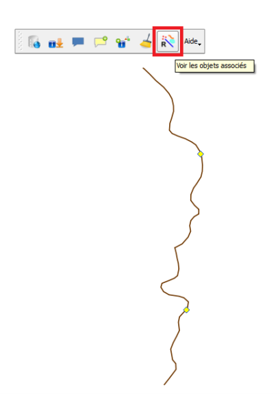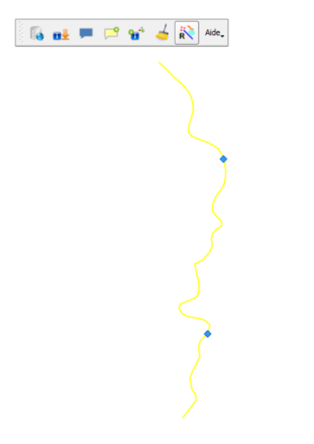
  <p><strong><span style="color: #548DD4">Figure 19  : Exemple d’utilisation de la « Baguette magique »</span></strong></p>
</div>

Si on clique à nouveau sur le bouton, on retrouve la première situation avec les deux signalements sélectionnés.

### <span style="color: white; background-color: #00ADC5; padding: 2px 5px; width: 100%;">5.10 Charger les couches de son groupe actif</span><span style="color: red">Evolution !</span>

<div  style="text-align: center;"> 
	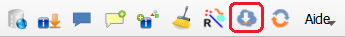
</div>
 
Cliquer sur le bouton **<span style="font-family: Consolas, monospace; color:#0000FF">Charger les couches de mon groupe</span>**.

**->** Si l’utilisateur n’appartient à aucun groupe, ou si le gestionnaire de son groupe n’a pas paramétré sa carte sur le site web Espace collaboratif, un message indiquant qu’il n’y a pas de données à charger apparaît.

**->** Si l’utilisateur appartient bien à un groupe ayant paramétré sa carte, la fenêtre de chargement des couches disponibles apparaît :

<div  style="text-align: center;"> 
	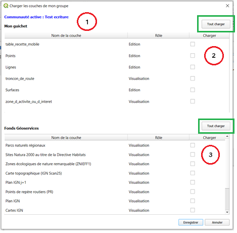
  <p><strong><span style="color: #548DD4">Figure 20  : Fenêtre de chargement des couches du groupe</span></strong></p>
</div>

Le formulaire de chargement des couches du groupe est composé de la façon suivante :

 1.  Rappel de la communauté (groupe) active, choisi par l’utilisateur lors de sa connexion au service.

2.  **Mon guichet :** liste des couches du groupe, hébergées sur l’Espace collaboratif, paramétrées sur la carte du groupe. La colonne Rôle indique pour chaque couche si elle est modifiable (rôle « Edition ») ou disponible en lecture seule (rôle « Visualisation »). Un bouton « Tout charger » a été rajouté permettant de tout cocher en une fois.

3.  **Fonds Géoportail :** liste des couches Géoportail configurées sur la carte du groupe. Un bouton « Tout charger » a été rajouté permettant de tout cocher en une fois.

L’utilisateur doit alors cocher les couches qu’il souhaite charger dans son projet QGIS, puis cliquer sur Enregistrer :

**->** Les couches sélectionnées sont ajoutées dans la carte QGIS.

**->** Dans le gestionnaire de couches, les couches du groupe sont regroupées au sein d’un même groupement de couches, portant le nom du groupe actif précédé de [ESPACE CO].

<div  style="text-align: center;"> 
	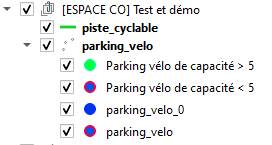
  <p><strong><span style="color: #548DD4">Figure 21  : Aperçu du gestionnaire de couches</span></strong></p>
</div>

**A noter :**
Pour les gros jeux de données comme la BDTopo IGN, il est fortement conseillé, voire obligatoire, de sélectionner une zone de travail lors de la connexion au service sans quoi le téléchargement ne pourra aboutir.

**->** l’utilisateur peut charger les couches d’un seul groupe à la fois. Si son projet QGIS contient déjà les couches d’un autre groupe, chargées via le plugin Espace collaboratif, elles seront supprimées lors de la connexion à un autre groupe.

**->** Les couches chargées ne sont visibles qu’aux niveaux de zoom définis pour chacune d’entre elles sur l’Espace collaboratif. Ceux-ci peuvent être modifiés par l’administrateur de la base en cas de besoin.

**->** Les fonctionnalités QGIS « Zoomer sur la couche » et « Zoomer sur le groupe » (accessibles après un clic droit sur une couche ou un groupe de couches dans le gestionnaire de couches) ne fonctionnent pas correctement avec les couches issues de l’Espace collaboratif. On peut alors :
  - soit zoomer manuellement sur les données pour les visualiser,
  - soit ouvrir la table attributaire de la couche souhaitée, sélectionner un objet et cliquer sur « Zoomer la carte sur les entités sélectionnées ».

**->** En cas d’erreur indiquant que « Le téléchargement des entités a échoué. L’opération est annulée », il peut être nécessaire d’augmenter le paramètre QGIS « Délai d’abandon pour les requêtes réseaux ». Ce paramètre est accessible dans le menu Préférences > Option > Réseau, et peut être rempli avec une valeur de l’ordre de 60000 ms.

### <span style="color: white; background-color: #00ADC5; padding: 2px 5px; width: 100%;">5.11 Editer les couches du groupe (contribution directe)</span>

Les couches du groupe, chargées à l’étape précédente, définies avec un rôle « Edition » peuvent être modifiées par l’utilisateur avec les outils d’édition de QGIS. **Attention :** une connexion internet est nécessaire pour enregistrer les modifications de ces couches.

La marche à suivre pour modifier les données d’une couche issu de l’Espace collaboratif est la suivante :

**->** Sélectionner la couche à modifier dans le gestionnaire de couches et entrer en mode Edition en cliquant sur le bouton QGIS « Basculer en mode édition » :

<div  style="text-align: center; "> 
	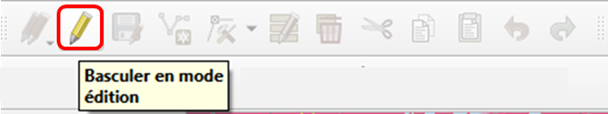
</div>

**->** Une fois le mode Edition activé, de nouveaux outils d’édition sont proposés par QGIS. Ces outils diffèrent selon le type géométrique de la couche à modifier (points, lignes ou surfaces). L’utilisateur peut alors créer, supprimer, modifier géométriquement et sémantiquement les objets de la couche à l’aide de ces outils :

<div  style="text-align: center;"> 
	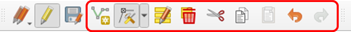
</div>

**->** Cliquer sur le bouton « Enregistrer les modifications de la couche » pour enregistrer les modifications réalisées. Celles-ci sont automatiquement enregistrées dans la base de données stockée sur l’Espace collaboratif.

<div  style="text-align: center;"> 
	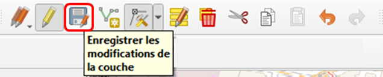
</div>

**<span style="color:red">Nouveau !</span>**
**Ajout de contraintes d’expression sur plusieurs champs**, par exemple si l’utilisateur change la catégorie de l’objet alors certains attributs apparaissent en orange dans la fiche car il ne se correspondent plus.

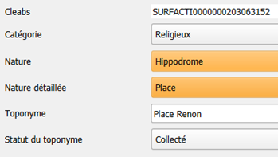

**_NB : pour retrouver cette contrainte d’expression, sélectionner la couche/Propriétés/Formulaire d’attributs, sélection du champ puis Contraintes/Expression_**

### <span style="color: white; background-color: #00ADC5; padding: 2px 5px; width: 100%;">5.12 Mettre à jour les couches Espace collaboratif</span>

<div  style="text-align: center;"> 
	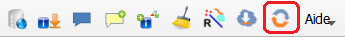
</div>

Le bouton **<span style="font-family: Consolas, monospace; color:#0000FF">Mettre à jour les couches Espace collaboratif</span>** permet de mettre à jour les couches issues de l’Espace collaboratif et chargées dans QGIS, afin de récupérer les évolutions qui auraient pu y avoir été apportées en parallèle du travail de l’utilisateur.

**->** Si les couches appartiennent à une base de données historisées, seules les mises à jour postérieures ayant eu lieu après le téléchargement des données dans QGIS sont récupérées.

**->** Si les couches appartiennent à une base de données non historisée, elles sont entièrement re-téléchargées.

La mise à jour ne se fait que sur la zone de travail sélectionnée par l’utilisateur lors de la connexion au service.

<u>A noter</u> : il est conseillé de mettre à jour régulièrement les données, en particulier si le travail via le plugin se fait de manière ponctuelle et est entrecoupé de périodes d’inactivité.

### <span style="color: white; background-color: #00ADC5; padding: 2px 5px; width: 100%;">5.13 Configurer le plugin IGN_Espace_collaboratif</span>

<div  style="text-align: center;"> 
	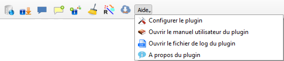
</div>

Cliquer sur **<span style="font-family: Consolas, monospace; color:#0000FF">Configurer le plugin</span>**  dans le menu Aide permet d’ouvrir le formulaire d'édition des paramètres de fonctionnement du plugin. Tous ces paramètres sont stockés dans le fichier de configuration espaceco.xml.

Dans ce formulaire peuvent être édités les paramètres suivants :

-   **Adresse de connexion au service Espace collaboratif** : l’url du service : https://espacecollaboratif.ign.fr (il est recommandé de la modifier uniquement en cas d’instruction de la part de l’IGN).
-   **Proxy** : permet à l’utilisateur de rentrer ses paramètres de proxy (s’il en a un) directement depuis cette interface. Attention, la définition d’un proxy dans l’interface de QGIS (menu Préférences > Options > Réseau) ne suffit pas, il doit être défini via ce paramètre pour être pris en compte lors de la connexion à l’Espace collaboratif. En cas de problème de proxy, il peut être nécessaire de définir les variables d’environnement HTTP_PROXY et HTTPS_PROXY comme indiqué page 10.

- **Date d’extraction** si la case est cochée, seuls les signalements mis à jour depuis cette date seront téléchargés.

-   **Couches sources et champs** : permet de paramétrer les attributs à envoyer avec les croquis liés aux signalements. Ce paramétrage sera appliqué si la case « Couches sources et champs… » est cochée. Par défaut, tous les champs d’un objet utilisé comme croquis seront envoyés.

<div  style="text-align: center;"> 
	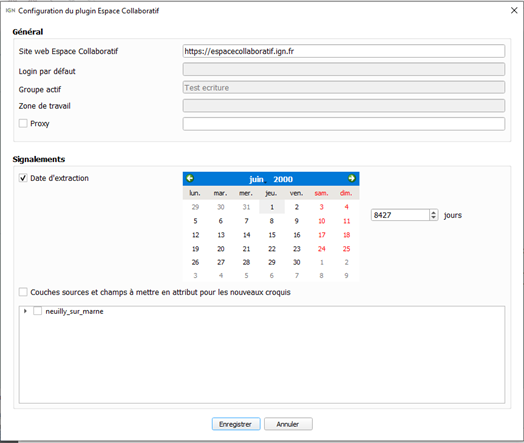
  <p><strong><span style="color: #548DD4">Figure 22: Le formulaire de configuration du plugin.</span></strong></p>
</div>

### <span style="color: white; background-color: #00ADC5; padding: 2px 5px; width: 100%;">5.14 Accéder au manuel utilisateur</span>

<div  style="text-align: center;"> 
	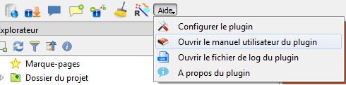
</div>

Ouvre la dernière version du manuel utilisateur.

### <span style="color: white; background-color: #00ADC5; padding: 2px 5px; width: 100%;">5.15 Afficher le fichier journal du plugin</span>

<div  style="text-align: center;"> 
	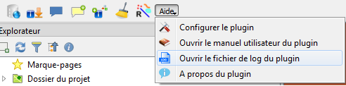
</div>

Le plugin IGN_Espace_collaboratif enregistre le déroulé des événements dans un fichier journal. Pour le consulter, il suffit de cliquer sur **<span style="font-family: Consolas, monospace; color:#0000FF">Ouvrir le fichier log du plugin</span>** du menu **<span style="font-family: Consolas, monospace; color:#0000FF">Aide</span>**.

En cas de dysfonctionnent, il peut être utile de consulter ce log pour connaître la description complète de l’erreur qui est à l’origine du problème. Dans le cadre de sa démarche d’assistance pour les logiciels qu’il distribue, l’IGN pourrait être amené à demander qu’on lui envoie ce log pour analyser la cause du dysfonctionnement.

### <span style="color: white; background-color: #00ADC5; padding: 2px 5px; width: 100%;">5.16 Le menu À propos du plugin IGN_Espace_collaboratif</span>

Permet d’afficher les informations de version du plugin.

### <span style="color: white; background-color: #00ADC5; padding: 2px 5px; width: 100%;">5.17 Changement d'utilisateur ou de groupe</span>

<u>Le changement de groupe est simple</u>. On peut recliquer sur la connexion,

1. vous obtenez la fenêtre web suivante, vous indiquant que vous pouvez fermer la fenêtre web et retourner dans QGIS :

<div  style="text-align: center;"> 
	
</div>

2. suivi, par la fenêtre de paramétrage QGIS du groupe et de l’emprise.

<div  style="text-align: center;"> 
	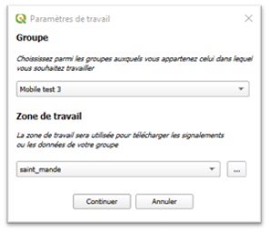
</div>

<u>Le changement d’utilisateur nécessite de se déconnecter proprement dans l’interface web</u>. (cas où vous étiez connecté avec un précédent utilisateur, différent de celui qui vous souhaitez maintenant)

1. Cliquer sur Connexion dans QGIS.

2. Deux pages web s’ouvrent :

<div  style="text-align: center;"> 
	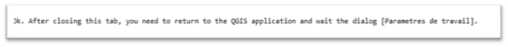
</div>

Et

<div  style="text-align: center;"> 
	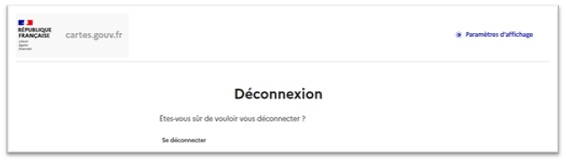
</div>

3. **Cliquer sur se déconnecter.** Vous obtenez ce message web.

<div  style="text-align: center;"> 
	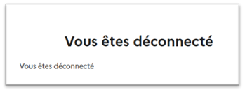
</div>

Si la déconnexion échoue. Fermer tous les onglets du navigateur web et recommencer depuis l’étape 1.

4. Une fois déconnecté vous pouvez vous connecter en changeant d’utilisateur.

<div  style="background-color: white; border: 1px solid black; padding: 3px; text-align: justify;">
  <h2 style="color: #00ADC5">6. Annexes</h2>
</div>

### <span style="color: white; background-color: #00ADC5; padding: 2px 5px; width: 100%;">6.1 Tableau 1 : champs du calque Signalement</span>

| Nom | Type  | Contenu |
|--|--|--|
| NoSignalement |int  |L'identifiant unique d'un signalement|
|Auteur|string|Le login du compte Espace collaboratif utilisé par le rédacteur du signalement.|
|Commune|string|Le nom de la commune dans laquelle se trouve le signalement|
|Département|string|Le nom du département dans lequel se trouve le signalement|
|Département_id|string|Le code du département dans lequel se trouve le signalement|
|Date_création|Date & heure|La date et l'heure de saisie du signalement (création dans le service).|
|Date_MAJ|Date & heure|La date et l'heure de la dernière action apportée au signalement. (ajout d'une réponse, changement de statut et clôture du signalement.)|
|Date_validation|Date & heure|La date et l'heure de l'action de clôture du signalement (prise en compte ou rejet)|
|Thèmes|string|La concaténation du nom des thèmes associés au signalement ainsi que des éventuels attributs.|
|Statut|int|Le stade d'avancement dans la chaîne de traitement du signalement|
|Message|string|Le commentaire envoyé lors de la création du signalement|
|Réponses|string|La concaténation des réponses apportées à le signalement|
|URL|string|Lien vers la fiche publique du signalement sur l’espace collaboratif|
|Document|string|Lien vers le fichier associé à le signalement et téléchargeable depuis l’espace collaboratif.|


### <span style="color: white; background-color: #00ADC5; padding: 2px 5px; width: 100%;">6.2 Tableau 2 : champs des calques Croquis_EC</span>

| Nom du champ | Type de champ | Contenu du champ |
|--|--|--|
| NoSignalement |int|Le numéro signalement à laquelle le croquis est associé.|
|Nom|string|Le nom du croquis.|
|Attributs_croquis|string|Concaténation des éventuels attributs du croquis sous forme : nom attribut = "valeur attribut".|

### <span style="color: white; background-color: #00ADC5; padding: 2px 5px; width: 100%;">6.3 Tableau 3 : Valeurs et signification des statuts d'un signalement</span>

<div  style="text-align: center;"> 
	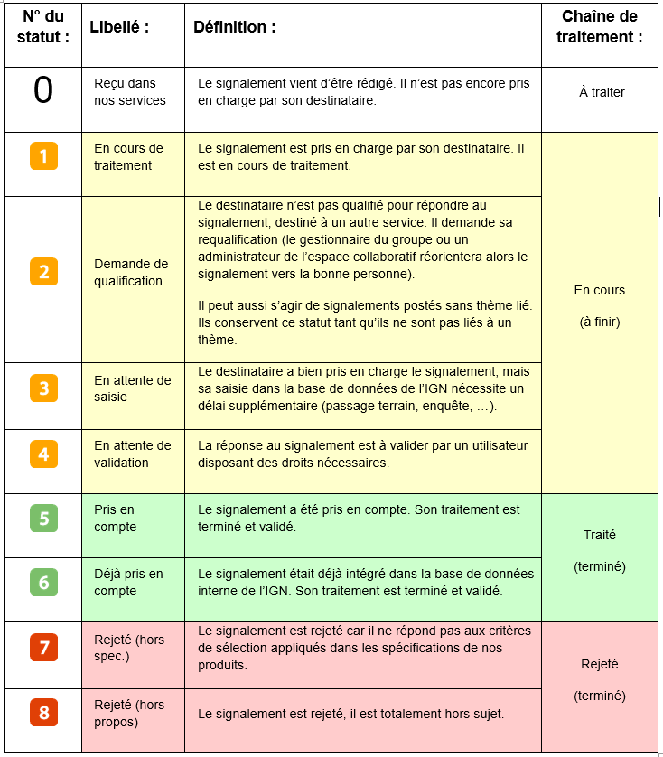
</div>

### <span style="color: white; background-color: #00ADC5; padding: 2px 5px; width: 100%;">6.4 Formats acceptés pour les documents joints</span>

jpg, png, gif, bmp, tif, aiff, asf, avi, flv, mid, mng, mka, mkv, mov, mp3, mp4, mpg, ogg, qt, ra, ram, rm, svg, swf, wav, wmv, abw, ai, bz2, bin, blend, c, css, csv, deb, doc, djvu, dvi, eps, gz, h, html, kml, kmz, pas, pdf, pgn, ppt, ps, psd, rpm, rtf, sdd, sdw, sit, sxc, sxi, sxw, tex, tgz, torrent, ttf, txt, xcf, xls, xml, zip, odt, ods, odp, odg, odc, odf, odb, odi, odm, ott, ots, otp, otg, gpx, gxt, dxf, crq, docx, xlsx.

### <span style="color: white; background-color: #00ADC5; padding: 2px 5px; width: 100%;">6.5 Fichiers nécessaires au fonctionnement du plugin</span>

<div  style="text-align: center;"> 
	
</div>


### <span style="color: white; background-color: #00ADC5; padding: 2px 5px; width: 100%;">6.6 Exemple de contenu du fichier de configuration espaceco.xml</span>

```xml
<Paramètres_connexion_à_Ripart>
    <Serveur>
        <URLHost>https://espacecollaboratif.ign.fr</URLHost>
        <Login>mon_login</Login>
        <Proxy />
        <cle_geoportail>Démonstration</cle_geoportail>
        <groupe_actif>Test ecriture</groupe_actif>
        <groupe_prefere>Test ecriture</groupe_prefere>
    </Serveur>
    <Map>
        <Date_extraction>01/06/2015 00:00:00</Date_extraction>
        <Pagination>100</Pagination>
        <Zone_extraction>emprise</Zone_extraction>
        <Thèmes_préférés>
            <Thème>Administratif</Thème>
        </Thèmes_préférés>
        <Afficher_Croquis>Oui</Afficher_Croquis>
        <Import_pour_groupe>true</Import_pour_groupe>
        <Attributs_croquis>
            <Calque_Nom>lines</Calque_Nom>
            <Calque_Champ>name</Calque_Champ>
            <Calque_Champ>desc</Calque_Champ>
            <Calque_Champ>date</Calque_Champ>
        </Attributs_croquis>
    </Map>
</Paramètres_connexion_à_Ripart>
```
